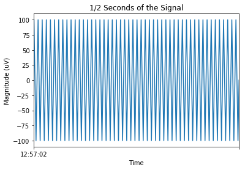
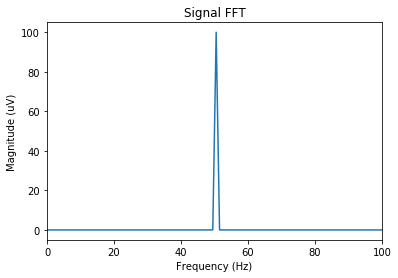

.. _Pennsieve annotation file (.bfannot): http://help.pennsieve.com/pennsieve-time-series-file-format-bfts

Working with Timeseries Data
===============================

This part of the tutorial provides a complete set of examples that show how to interface, manipulate and work with timeseries data with the pennsieve python client.

Channels and Data Manipulation Basics
-------------------------------------

Let's start by creating a dataset where we can store the data that we
will be using for this tutorial. If you would like to find out more
information about moving, uploading, downloading data or other data
catalog operations, please look into the
:ref:`working with the data catalog <tutorials/data_catalog:Working with the data catalog>` tutorial.

.. code-block:: python
   :linenos:

    # import Pennsieve
    from pennsieve import Pennsieve

    # create a client instance
    ps = Pennsieve()

    # create a dataset
    ds = ps.create_dataset('Timeseries Dataset')

We will now upload timeseries files to our dataset from the tutorial's data directory:

.. code-block:: python
   :linenos:

    ds.upload('example_data/test.edf', 'example_data/testData.nev', 'example_data/testData.ns2')

We have now uploaded two different tiemseries files into the Pennsieve
platform. Even though these two files are in two different formats (one
is an EDF file, while the other one is a NEV/NSx file) the Pennsieve importer
stores them in a general :ref:`Timeseries PS Package <models:Timeseries>`
with the same attributes and properties.

We will now explore some of the different things that we can do with
timeseries data through the Python client.

First, we will get our timeseries packages from the platform, and then,
we will check some of the channel information in each of the files.

.. code-block:: python
   :linenos:

    ds.update()
    ds.items

.. code-block:: console

    [<TimeSeries name='test' id='N:package:2f5a17da-0dc1-4ca0-a2c3-d633d99a3023'>,
     <TimeSeries name='testData' id='N:package:1e2e616b-4c40-4eda-9e62-5114ce462ba1'>]

As it was mentioned before, we can see that the files have been imported
as *Pennsieve Timeseries* files. Note that you need to call `update()` in order
to synchronize uploaded items with the client.

.. code-block:: python
   :linenos:

    # get the files from the Pennsieve platform
    ts1 = ds[0]
    ts2 = ds[1]

    # show the channel objects for the first timeseries file
    ts1.channels

.. code-block:: console

    [<TimeSeriesChannel name='sine 8.1777 Hz' id='N:channel:33525e64-03c0-4241-9ecf-52e0ec380040'>,
     <TimeSeriesChannel name='ramp' id='N:channel:1ba73070-b6ad-4cdf-b45e-995237760528'>,
     <TimeSeriesChannel name='sine 15 Hz' id='N:channel:4e7852b2-7b2e-479e-87d6-b4918e14bcad'>,
     <TimeSeriesChannel name='noise' id='N:channel:c4346f36-e411-44c4-8498-8ee736262c0c'>,
     <TimeSeriesChannel name='sine 17 Hz' id='N:channel:f972434b-e2ce-401d-b4ec-aa105cf83ab5'>,
     <TimeSeriesChannel name='sine 50 Hz' id='N:channel:affcbd60-dc63-477b-80e5-a64a7a78a9fd'>,
     <TimeSeriesChannel name='pulse' id='N:channel:3077199a-5dcf-4ce9-8779-10bab7a30a41'>,
     <TimeSeriesChannel name='sine 1 Hz' id='N:channel:psdfaa97-6b56-4c48-9809-4cacd17e8211'>,
     <TimeSeriesChannel name='squarewave' id='N:channel:7c5633d7-2607-422a-908b-707310068579'>,
     <TimeSeriesChannel name='sine 8 Hz' id='N:channel:798d526c-626f-4830-8cc0-184ed81a6ffc'>,
     <TimeSeriesChannel name='sine 8.5 Hz' id='N:channel:28fe4333-e82c-444e-be38-e7195c24ff57'>]

As we have seen with other types of Pennsieve entities, the channels for
timeseries packages are associated with a name and a unique ID.

.. code-block:: python
   :linenos:

    # show general channel information for our first file
    print("---------------- Information for File: {} ----------------\n".format(str(ts1.name)))

    # nicely print the names and IDs of the channels for the first timeseries file
    print("The channels available for this file are:")
    for i in ts1.channels:
        print(i.name, "with ID = ", i.id)

    # show the number of channels in file
    print()
    print("File '{}' has {} channels\n".format(ts1.name, len(ts1.channels)))

    # show general channel informatio for our second file
    print("---------------- Information for File: {} ----------------\n".format(str(ts2.name)))

    # nicely print the names and IDs of the channels for the second timeseries file
    print("The channels available for this file are:")
    for i in ts2.channels:
        print(i.name, "with ID = ", i.id)

    # show the number of channels in file
    print()
    print("File '{}' has {} channels\n".format(ts2.name, len(ts2.channels)))

.. code-block:: console

    ---------------- Information for File: test ----------------

    The channels available for this file are:
    sine 8.1777 Hz with ID =  N:channel:33525e64-03c0-4241-9ecf-52e0ec380040
    ramp with ID =  N:channel:1ba73070-b6ad-4cdf-b45e-995237760528
    sine 15 Hz with ID =  N:channel:4e7852b2-7b2e-479e-87d6-b4918e14bcad
    noise with ID =  N:channel:c4346f36-e411-44c4-8498-8ee736262c0c
    sine 17 Hz with ID =  N:channel:f972434b-e2ce-401d-b4ec-aa105cf83ab5
    sine 50 Hz with ID =  N:channel:affcbd60-dc63-477b-80e5-a64a7a78a9fd
    pulse with ID =  N:channel:3077199a-5dcf-4ce9-8779-10bab7a30a41
    sine 1 Hz with ID =  N:channel:psdfaa97-6b56-4c48-9809-4cacd17e8211
    squarewave with ID =  N:channel:7c5633d7-2607-422a-908b-707310068579
    sine 8 Hz with ID =  N:channel:798d526c-626f-4830-8cc0-184ed81a6ffc
    sine 8.5 Hz with ID =  N:channel:28fe4333-e82c-444e-be38-e7195c24ff57

    File 'test' has 11 channels

    ---------------- Information for File: testData ----------------

    The channels available for this file are:
    Channel 28 with ID =  N:channel:dda784e9-60c9-4a63-a706-b75c224efa5f
    lfp 14 with ID =  N:channel:4f34e215-90f1-4cd2-9716-6bb57a29a3ca
    lfp 9 with ID =  N:channel:4f088d05-7f13-4451-808f-6f4125071e71
    Channel 14 with ID =  N:channel:eff8d8b9-d04f-4c67-a1ed-4797ffc170b2
    Channel 5 with ID =  N:channel:4ace7ec5-8b38-464a-89cc-12f569434c4f
    lfp 17 with ID =  N:channel:35d90c81-add8-4835-84ba-509fb1cded9a
    Channel 15 with ID =  N:channel:7cecc48a-a62e-450d-apse-9ac3ad08371d
    lfp 12 with ID =  N:channel:9734aeb7-ca57-4e6d-b497-6cb4197f7dda
    lfp 2 with ID =  N:channel:37ad2beb-7244-4997-8c68-2aca3ebc73e7
    Channel 22 with ID =  N:channel:3dfc1658-17cc-4f3b-95b4-b52b919a15e1
    Channel 25 with ID =  N:channel:d8405633-2eff-4056-8e8c-fe762f80e8c2
    lfp 13 with ID =  N:channel:9ebd4d4d-3438-4895-b7d4-33e4539721c7
    Channel 10 with ID =  N:channel:dc7e53de-f051-42fd-9e22-938d2b7dd026
    Channel 20 with ID =  N:channel:64852749-4e5c-446e-8753-7021af46a709
    lfp 18 with ID =  N:channel:59f6d421-9cde-4690-9800-d153064445b8
    Channel 9 with ID =  N:channel:c4012f63-4a97-43f5-95b5-e73cfde9a2b9
    Channel 18 with ID =  N:channel:3edfbe3e-fd10-4a86-9a80-40321e4b08a0
    Channel 21 with ID =  N:channel:f6d57002-5ed3-45da-aa32-a53590e7cf9e
    Channel 12 with ID =  N:channel:b91586a0-7455-4d4a-be91-231a54d81781
    Channel 8 with ID =  N:channel:84a6f8ba-8e72-4c0d-8f04-cfa6233efa73
    Channel 3 with ID =  N:channel:9930d7d5-65f2-4e61-b7fa-dpsa6ff24df3
    Channel 19 with ID =  N:channel:f905454d-7ed7-474f-8c90-1cps73c609db
    Channel 2 with ID =  N:channel:51c94efa-ccee-4911-a212-36e9a791a88f
    Channel 7 with ID =  N:channel:20e05b30-fcf8-47b9-9377-379e49eee8c5
    Channel 30 with ID =  N:channel:150511cf-2545-4f4f-a2cc-d29b472f21c1
    lfp 1 with ID =  N:channel:ca210755-c59a-4494-8b84-f6c9d8677d2a
    lfp 8 with ID =  N:channel:8ac33e82-7f5d-453f-9e35-0ad8be7bee1c
    lfp 30 with ID =  N:channel:6b6c1164-001f-4949-95a5-20995feee482
    analog 1 with ID =  N:channel:ff90b8a1-948b-429c-8a3a-41175e866536
    Channel 16 with ID =  N:channel:43psb686-0552-4580-afbb-7eps17c147a4
    Channel 29 with ID =  N:channel:cf11daf7-c808-45a6-b620-0e9fb19b29c6
    lfp 4 with ID =  N:channel:46d5e4f8-59c2-4dc5-bc85-2e4105ffb703
    lfp 24 with ID =  N:channel:89e8715b-34fa-4f47-8a46-2112bc64d082
    Channel 27 with ID =  N:channel:538270d8-81a3-4aa6-8efc-010e69fe7b32
    lfp 21 with ID =  N:channel:f3c3c216-7451-4060-af61-b97f5faba780
    Channel 6 with ID =  N:channel:5385d340-2623-4e7f-9e9b-2b79c72067c7
    lfp 31 with ID =  N:channel:59315384-137a-4f58-8c9e-03c00d05e94f
    Channel 1 with ID =  N:channel:bb45e350-c28d-46b5-a744-5347b99a87a9
    lfp 10 with ID =  N:channel:dcf576c8-4aa5-4361-98ca-1bc6b80c0917
    lfp 23 with ID =  N:channel:924fe579-5cc1-491a-960a-484693a9666a
    lfp 7 with ID =  N:channel:afeeeada-e5b9-4173-99fe-ca9ef2617d24
    Channel 11 with ID =  N:channel:301e908d-88ce-4c40-850f-d164853276f2
    Channel 24 with ID =  N:channel:b1f9ab1f-713f-4e74-9cd6-31b3863072a0
    lfp 16 with ID =  N:channel:d13c9822-864a-4bd7-a6ed-57b70538d8ab
    lfp 29 with ID =  N:channel:46a9077f-e86b-4161-b08f-df5ec9706232
    lfp 22 with ID =  N:channel:66976353-ce74-48b4-9146-492f0ee8eefa
    lfp 28 with ID =  N:channel:619817e3-5f80-4496-b0e8-b162b0ae1eb3
    lfp 20 with ID =  N:channel:8be0539e-0343-4789-bd7f-ea8320067f59
    lfp 6 with ID =  N:channel:4a1f7dd5-1cd7-4fcf-a9ad-befef540e99c
    lfp 11 with ID =  N:channel:43e898de-5ad2-470a-a5aa-1fbdcaa9ffc3
    Channel 13 with ID =  N:channel:943632cc-1072-46a7-a327-2da7f2dbcba7
    lfp 27 with ID =  N:channel:0c15e502-963f-49eb-bd28-c7a7fcce2431
    lfp 19 with ID =  N:channel:c3a8e032-c785-405e-ps24-8a8244de3c5c
    lfp 3 with ID =  N:channel:969c0743-e163-471b-bdfb-fa5e8c8fe333
    Channel 32 with ID =  N:channel:6eadc859-8c76-4827-ad82-46fb66cb60fe
    lfp 15 with ID =  N:channel:ca989c0d-1be4-435c-a7f2-c631437ec669
    Channel 4 with ID =  N:channel:7d5126f3-8412-4dcb-b784-a9c2e00f6cf6
    lfp 32 with ID =  N:channel:907522a2-d2e2-4d12-b0ef-1acb33ffd2c4
    Channel 31 with ID =  N:channel:9a40ccce-bcb5-40e1-ba39-8e280f3dc3c2
    Channel 17 with ID =  N:channel:7331636c-fd3b-4349-817a-5061ffa3c207
    lfp 25 with ID =  N:channel:ddf0d504-5f6e-4dfc-a96f-df4acf13a82f
    lfp 5 with ID =  N:channel:eb6974b9-00d9-46b0-abc1-6aapsa1e07cf
    Channel 23 with ID =  N:channel:cc52da48-1276-4cc4-8cf7-906a3324c0d5
    Channel 26 with ID =  N:channel:95293b12-b811-48cb-9ad8-29c35d2cf861
    lfp 26 with ID =  N:channel:36bc99d3-2cf4-48cd-bec5-7bd683da75fc

    File 'testData' has 65 channels

As we mentioned before, even though the file format for the two original
files was different (EDF vs. NEV/NSx), the Pennsieve data packages can be
manipulated and utilized in the same general way. Besides getting
general infomation about the channels, we can also get the channels data
and perform different opperations with it. This is demonstrated in the
following section, as we calculate the `Fast Fourier Transform <https://en.wikipedia.org/wiki/Fast_Fourier_transform>`_ of a data window:

.. note::
   In order to plot the data as shown in the following part of the tutorial,
   you need to have installed `matplotlib <https://matplotlib.org/users/installing.html>`_.

.. code-block:: python
   :linenos:

    # importing fft module and plotting lib and pandas
    import numpy as np
    from numpy.fft import fft
    import matplotlib.pyplot as plt
    import pandas as pd

    # get 1 second of data for all channels
    # this gets the data into a pandas dataframe format
    data = ts1.get_data(length='1s')

    # take the data from the 'sine 50 Hz' channel and plot it
    d = data['sine 50 Hz']
    d.plot()

    # adjust axes of plot and add labels
    axes = plt.gca()
    axes.set_title('1/2 Seconds of the Signal')
    axes.set_xlabel('Time'); axes.set_ylabel('Magnitude (uV)')
    plt.show()

.. code-block:: python
   :linenos:

    # convert data into nupy array
    d = np.asarray(data['sine 50 Hz'])

    # calculate the fft of the signal
    d_fft = fft(d)

    # define number of samples, and spacing between samples
    N=d.size
    T=1/ts1.channels[0].rate

    # define frequency axis
    freqs = np.linspace(0.0,1.0/(2.0*T),N/2)

    # convert to pandas dataframe and plot fft of the data
    d_fft=pd.DataFrame(d_fft)
    plt.plot(freqs, 2.0/N * np.abs(d_fft[:N//2]));

    # adjust axes of plot and add labels
    axes = plt.gca()
    axes.set_title('Signal FFT')
    axes.set_xlabel('Frequency (Hz)'); axes.set_ylabel('Magnitude (uV)')
    axes.set_xlim([0,100]);plt.show()

We can see that we used the downloaded channel data in order to compute
the FFT of the signal. This only shows one example of something that can
be done with the timeseries data. As it was shown, the ``get_data()``
method organizes the downloaded data into a Pandas dataframe, which is
flexible and allows us to easily find more information about the data,
derive different representations and generally operate on the data.

Adding Annotation Layers to Timeseries Packages
-----------------------------------------------

Besides manipulating the already existing data, the client allows
users to add new channels and create annotation layers and annotation events
for a given package. In this part of the tutorial, we will explore the addition
annotations to a timeseries package. Annotations can be added to a specific
channel (or group of channels) for focal events or to all the channels
for generalized observations.

Through the python client, there are two ways to add annotations to a timeseries
package. The first way is through the ``insert_annotation()`` method, which is
convenient when adding a small number of annotations to a file. The second way
is through a `Pennsieve annotation file (.bfannot)`_ which is a simple CSV based
format that facilitates the attachment of a large number of annotations to one
or several timeseries files.

Adding Annotations Individually
^^^^^^^^^^^^^^^^^^^^^^^^^^^^^^^

First, we will show how to add annotation layers to a file through the
``insert_annotation()`` method.

.. code-block:: python
   :linenos:

    # insert annotations
    ts1.insert_annotation('new_layer_1', 'sample_event_1', start=ts1.start, end=(ts1.start+20000000), channel_ids=ts1.channels[0].id)
    ts1.insert_annotation('new_layer_1', 'sample_event_2', start=ts1.start, end=(ts1.start+60000000), channel_ids=ts1.channels[1].id)
    ts1.insert_annotation('new_layer_2', 'sample_event', start=ts1.start, end=(ts1.start+4000000))
    ts1.update()

    print("\nCurrent Layers:")
    print(ts1.layers)

    # get entire annotation layer
    annot_layer1 = ts1.get_layer('new_layer_1')

    # print annotation information for first layer
    print("\nInformation for Layer:", annot_layer1.name)
    for annotation in annot_layer1.annotations():
        print("label:", annotation.label, "channels:", annotation.channel_ids, "start:", annotation.start, "end:", annotation.end)

.. code-block:: console

    Returning existing layer [<TimeSeriesAnnotationLayer name='new_layer_1' id='306'>]
    Returning existing layer [<TimeSeriesAnnotationLayer name='new_layer_1' id='306'>]
    Returning existing layer [<TimeSeriesAnnotationLayer name='new_layer_2' id='307'>]

    Current Layers:
    [<TimeSeriesAnnotationLayer name='new_layer_1' id='306'>
     <TimeSeriesAnnotationLayer name='new_layer_2' id='307'>]

    Information for Layer: new_layer_1
    label: sample_event_1 channels: [u'N:channel:33525e64-03c0-4241-9ecf-52e0ec380040'] start: 1301921822000000 end: 1301921842000000
    label: sample_event_2 channels: [u'N:channel:1ba73070-b6ad-4cdf-b45e-995237760528'] start: 1301921822000000 end: 1301921882000000

We can see that we have created two new annotation layers. If the
``layer`` in
``insert_layer(layer, annotation, start=start_time, end=end_time, channel_ids=ids)``
does not exist, a new layer with the specified name is created. On the
other hand, if ``layer`` already exists for that package, then the
``annotation`` is created under that layer.

We created one layer called ``new_layer_1`` that contains two
annotations for events in different channels  (``sample_event_1`` and ``sample_event_2``).
In addition, we created a second annotation layer called ``new_layer_2`` with a generalized event
called ``sample_event``.

Adding Annotations from a File
^^^^^^^^^^^^^^^^^^^^^^^^^^^^^^^

If you have a large dataset with several annotations, it is much more convenient
to add the annotations from a file. The `Pennsieve annotation file (.bfannot)`_
format allows you to do this in a straightforward way.

We will add and get a new timeseries file that does not contain any
annotations.

.. code-block:: python
   :linenos:

    # upload new file
    ds.upload('example_data/test_10hz_1ms.bfts')
    ds.update()

    # show items of the database
    ds.items

.. code-block:: console

    [<TimeSeries name='testData' id='N:package:e98a4586-d0f2-4fe1-89be-ab777c2c41f0'>,
     <TimeSeries name='test' id='N:package:1df1b859-1653-4ps9-a287-28318468ef10'>,
     <TimeSeries name='test_10hz_1ms' id='N:package:ddfd5e30-e469-4fb1-ba2f-422e74782558'>]

.. code-block:: python
   :linenos:

    # getting the package object
    ts = ds[2]

    # show available channels
    print("Channels in file:")
    for chan in ts.channels:
        print(chan.name)

    # show annotation in file
    print("\nCurrent Annotation Layers:")
    for layer in ts.layers:
        print(layer)

.. code-block:: console

    Channels in file:
    chan012
    chan011
    chan000
    chan016
    chan021
    chan020
    chan024
    chan023
    chan009
    chan031
    chan017
    chan018
    chan026
    chan002
    chan006
    chan019
    chan013
    chan030
    chan022
    chan029
    chan005
    chan015
    chan010
    chan028
    chan004
    chan025
    chan001
    chan007
    chan027
    chan014
    chan008
    chan003

    Current Annotation Layers:

We see that the new file does not currently have any annotation layer.
We will now show the ``.bfannot`` file that we will be appending to the
file.

.. code-block:: python
   :linenos:

    # read .bfannot file to pandas dataframe
    import pandas as pd

    bf_annot = pd.DataFrame.from_csv('example_data/test.bfannot')
    bf_annot

.. csv-table:: test.bfannot
   :header-rows: 1
   :widths: 5 5 5 5 5 5 5 5 5
   :file: ../static/files/test.bfannot

The ``bfannot`` file specifies a series of annotations. In this example,
we will be creating two new annotation layers (``layer1`` and
``layer2``). A series of sample events are added to both layers. We will
add these annotations to our timeseries package by just simply using the
``append_annotation_file()`` method.

.. code-block:: python
   :linenos:

    # append annotation file to timeseries package
    ts.append_annotation_file('example_data/test.bfannot')

    # show annotation layers
    print("\nCurrent Annotation Layers:")
    for layer in ts.layers:
        print(layer)

.. code-block:: console

    Added annotations to layer <TimeSeriesAnnotationLayer name='layer1' id='309'> , pkg: <TimeSeries name='test_10hz_1ms' id='N:package:ddfd5e30-e469-4fb1-ba2f-422e74782558'>
    Added annotations to layer <TimeSeriesAnnotationLayer name='layer2' id='310'> , pkg: <TimeSeries name='test_10hz_1ms' id='N:package:ddfd5e30-e469-4fb1-ba2f-422e74782558'>

    Current Annotation Layers:
    <TimeSeriesAnnotationLayer name='layer1' id='309'>
    <TimeSeriesAnnotationLayer name='layer2' id='310'>

We see that annotation layers ``layer1`` and ``layer2`` have been added
to our timeseries package. We can now see the added events individually.

.. code-block:: python
   :linenos:

    # get entire first annotation layer
    layer1 = ts.get_layer('layer1')

    # print annotation information for first layer
    print("Information for Layer:", layer1.name)
    for annotation in layer1.annotations():
        print("label:", annotation.label, "channels: ", annotation.channel_ids, "start: ", annotation.start, "end: ", annotation.end)

    # get entire second annotation layer
    layer2 = ts.get_layer('layer2')

    # print annotation information for first layer
    print("\nInformation for Layer:", layer2.name)
    for annotation in layer2.annotations():
        print("label:", annotation.label, "channels: ", annotation.channel_ids, "start: ", annotation.start, "end: ", annotation.end)

.. code-block:: console

    Information for Layer: layer1
    label: 'event8' channels:  [u'N:channel:4d935925-7c20-42b5-b6ps-ee403295ffa9'] start:  0 end:  8000000
    label: 'event2' channels:  [u'N:channel:285621c9-e011-41bc-b182-9fa2d5d55707'] start:  0 end:  4000000
    label: 'event7' channels:  [u'N:channel:b376333b-f6fd-45c4-b6b6-d058f4ec14af'] start:  0 end:  7000000
    label: 'event1' channels:  [u'N:channel:0f6f8f27-8e44-4ead-a729-5f5646de0ff1'] start:  0 end:  2000000
    label: 'event5' channels:  [u'N:channel:05723911-c2b7-460d-b8cc-a384fbc13c6c'] start:  0 end:  2000000
    label: 'event6' channels:  [u'N:channel:36b9a8c7-0eac-4827-afb8-27db9d70a143'] start:  0 end:  6000000
    label: 'event4' channels:  [u'N:channel:b18f17c5-ff4b-430a-a852-5c14c0d01047'] start:  1000000 end:  15000000
    label: 'event3' channels:  [u'N:channel:7a5231ba-1caf-4dd7-8486-93ac31b20ca3'] start:  5000000 end:  10000000

    Information for Layer: layer2
    label: 'Newevent1' channels:  [u'N:channel:5a505ec2-93b3-4d07-a0dc-eaa9ac7f4661'] start:  0 end:  4000000
    label: 'Newevent2' channels:  [u'N:channel:38ccd079-7ee6-4d76-815c-1db54ad3ce4a'] start:  3000000 end:  6000000

The output shows that we have successfully added all of our annotation
files to the timeseries package.
